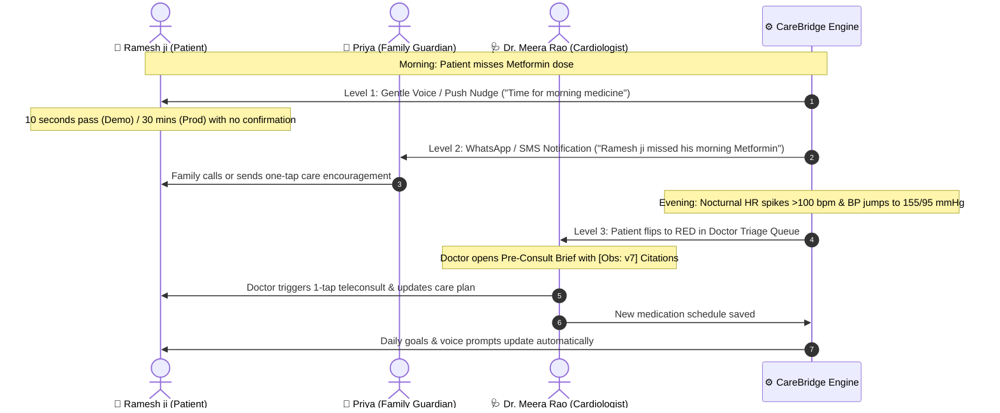
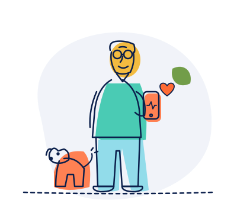
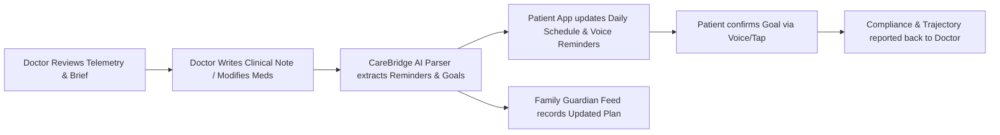

# CareBridge

<div align="center">


### Closing the distance between patient, family, and doctor.

[](https://nextjs.org/)
[](https://www.typescriptlang.org/)
[](https://tailwindcss.com/)
[](https://abdm.gov.in/)
[](https://developer.mozilla.org/en-US/docs/Web/API/Web_Speech_API)
[](https://jainuniversity.ac.in)

**Chenraj Roychand Centre for Entrepreneurship (CRCE) · Jain (Deemed-to-be University)**  
*Team **poweredbycaffine**: Swapnil (Lead / Product Architect) · Aman (Doctor Decision Support) · Vedesh (UI/UX & Accessibility) · Aryan (Backend & Risk Pipelines)*

> **Mandatory Regulatory Disclosure:** CareBridge is an outpatient clinical decision-support and triage companion. CareBridge does not autonomously diagnose medical conditions or alter drug dosages. **All clinical decisions remain with the treating physician. All prototype data is simulated for demonstration.**

---

### [Live Demo Flow](http://localhost:3000) · [Doctor Cockpit](http://localhost:3000/doctor/p1) · [Patient Mobile App](http://localhost:3000/patient) · [Family Feed](http://localhost:3000/family) · [Admin ROI](http://localhost:3000/admin) · [Simulator Console](http://localhost:3000/sim)

</div>

---

## Executive Summary & Core USP

### The Problem: Wearables Show Numbers, But Explain Nothing
Modern smartwatches and fitness apps inundate users with raw numbers, isolated heart rate charts, and step graphs. 
- **Patients** don't understand what their raw numbers actually signify and abandon routines.
- **Doctors** see patients for just 10 minutes every few months, completely blind to the critical 90 days of telemetry in between.
- **Distant Families** worry constantly but only discover health deteriorations after an emergency hospital admission.

### The CareBridge Paradigm
**CareBridge transforms raw passive smartwatch telemetry into actionable clinical meaning through an intelligent, bidirectional closed-loop:**

```
Smartwatch Raw Telemetry  ──▶  Deterministic Anomaly & LLM Interpretation
                                              │
              ┌───────────────────────────────┴───────────────────────────────┐
              ▼                                                               ▼
   Doctor Clinical Cockpit                                         Family Guardian Feed
  (Triage Red-Queue, Citations,                                  (Plain-language peace of mind,
    What-If Drug Simulator)                                        missed-dose escalation)
              │
              ▼
   Doctor Updates Care Plan
              │
              ▼
   Bidirectional Sync: Patient Daily Goals & Voice Interface Update Automatically
```

1. **Passive Telemetry to Plain Language:** Translates nocturnal heart rate spikes (>100 bpm) and activity drops into plain language for elderly patients in **Hindi, Kannada, and Indian English**.
2. **Dual-Endpoint Delivery:** Routes clinical insights to the **Doctor's Triage Cockpit** and proactive alerts to the **Family Guardian Feed**.
3. **Two-Way Closed-Loop Feedback:** When the doctor updates medication or lifestyle targets, CareBridge automatically updates the patient's daily goals and tracks recovery compliance.

---

## Validated Market Need & Clinical Evidence

<div align="center">
<table>
<tr>
<td width="33%" align="center">
<h3>51%</h3>
<b>Medication Non-Adherence</b><br/>
More than half of Indian chronic patients fail to follow daily prescriptions between clinic visits.<br/>
<i>(Source: WHO SAGE India Study)</i>
</td>
<td width="33%" align="center">
<h3>23.7 Crore</h3>
<b>Chronic Disease Burden</b><br/>
10.1 Crore diabetics and 13.6 Crore hypertensive individuals across India.<br/>
<i>(Source: Lancet ICMR-INDIAB Study, 2023)</i>
</td>
<td width="33%" align="center">
<h3>$1.37 Billion</h3>
<b>India RPM Market</b><br/>
Growing from $255M at a 20.5% CAGR as smartwatches and phones saturate Tier 1–3 cities.<br/>
<i>(Source: IMARC & MarketsandMarkets 2025)</i>
</td>
</tr>
</table>
</div>

### Market Size (TAM / SAM / SOM)
- **Total Addressable Market (TAM):** **23 Crore (230 Million)** individuals in India living with diabetes or hypertension.
- **Serviceable Available Market (SAM):** **3.5 Crore (35 Million)** urban seniors with smartphones whose healthcare is managed by working adult children.
- **Serviceable Obtainable Market (SOM):** Post-discharge cardiac and diabetic patients in private clinics across Bengaluru and Tier-1 metros.

---

## System Architecture & Data Flow

CareBridge is built on a clean, decoupled architecture with deterministic rule evaluation, grounded clinical citations, and zero-latency local fallback execution.

```mermaid
flowchart TB
    subgraph SENSORS ["1. Telemetry Ingestion Layer"]
        W[Smartwatch PPG / IMU]
        BPM[Bluetooth BP Monitor]
        Voice[Elderly Voice Log hi/kn/en]
    end

    subgraph ENGINE ["2. Deterministic & AI Processing"]
        Ingest[Wearable Context Processor]
        Rules[Deterministic Clinical Rules Engine<br/>HR > 100 nocturnal | Steps -30% | BP trend]
        BriefGen[Pre-Consult Brief Synthesizer<br/>Strict Grounded Evidence Citations]
    end

    subgraph STORAGE ["3. Data & Interoperability"]
        DB[(Supabase / In-Memory Store)]
        FHIR[ABDM FHIR R4 Exporter<br/>LOINC & SNOMED CT Mappings]
        RxNav[NIH RxNav Drug-Drug Checker]
    end

    subgraph ENDPOINTS ["4. Multi-Stakeholder Endpoints"]
        Doctor[Doctor Clinical Cockpit<br/>Red-Triage Queue & What-If Simulator]
        Family[Family Guardian Feed<br/>Real-Time Escalation Ladder]
        Patient[Patient Mobile App<br/>Elderly-First Voice UI]
        Admin[Hospital Admin ROI Panel<br/>Readmissions Cost Avoidance]
    end

    W --> Ingest
    BPM --> Ingest
    Voice --> Ingest
    Ingest --> Rules
    Rules --> DB
    Rules --> BriefGen
    BriefGen --> Doctor
    Rules --> Family
    Doctor -->|Two-Way Care Plan Update| Patient
    Doctor --> FHIR
    Doctor --> RxNav
    DB --> Admin
```

---

## The 3-Tier Escalation Ladder

Rather than overwhelming physicians with raw alert fatigue, CareBridge deploys a progressive, time-calibrated safety net:



---

## Core Product Modules

<div align="center">
<table>
<tr>
<td width="50%">

<h4 align="center">1. Elderly-First Patient Mobile App</h4>
<ul>
  <li><b>Voice Logging in Regional Tongues:</b> One-tap speech recognition in Hindi (<code>hi-IN</code>), Kannada (<code>kn-IN</code>), and English (<code>en-IN</code>).</li>
  <li><b>Accessibility First:</b> 20px+ readable typography, 56px touch targets, zero complex clinical jargon.</li>
  <li><b>Instant Goal Completion:</b> Visual checkboxes for medicine intake, morning walks, and hydration.</li>
</ul>
</td>
<td width="50%">

<h4 align="center">2. Doctor Clinical Decision Cockpit</h4>
<ul>
  <li><b>Risk-Ranked Triage Queue:</b> Patients sorted by real-time risk scores into Red, Amber, and Green bands.</li>
  <li><b>Evidence-Cited AI Brief:</b> 3-part pre-consult summary with verifiable citations (e.g. <code>[Obs: v7]</code>).</li>
  <li><b>"What-If" Medication Simulator:</b> Interactive 12-week trajectory model validated against NIH RxNav.</li>
</ul>
</td>
</tr>
<tr>
<td width="50%">

<h4 align="center">3. Family Guardian Peace-of-Mind Feed</h4>
<ul>
  <li><b>Proactive Transparency:</b> Real-time feed of logged doses, vitals trends, and doctor care plan revisions.</li>
  <li><b>Actionable Escalation:</b> Alerted only when intervention is needed; one-tap check-in calls.</li>
  <li><b>Distant Care:</b> Connects children in Delhi or New York with parents in Bengaluru.</li>
</ul>
</td>
<td width="50%">

<h4 align="center">4. Hospital Admin ROI & Simulator</h4>
<ul>
  <li><b>Averted Readmissions:</b> Models financial cost avoidance (₹6,30,000 saved across 14 averted readmissions for 100 monitored patients).</li>
  <li><b>ABDM FHIR R4 Bundle:</b> One-click standard health record export with LOINC and SNOMED CT codes.</li>
  <li><b>Interactive Simulation:</b> Test harness (<code>/sim</code>) to trigger missed doses and nocturnal HR surges live.</li>
</ul>
</td>
</tr>
</table>
</div>

---

## Two-Way Closed-Loop Feedback

The fundamental breakthrough of CareBridge is transforming outpatient care from a one-way monitoring stream into an **active bidirectional loop**:



---

## Competitive Differentiation

| Feature / Dimension | Traditional Telehealth (Practo, Apollo 24/7) | Consumer Wearables (Apple Watch, Fitbit) | CareBridge |
|---|---|---|---|
| **Primary Use-Case** | Episodic sick-care & appointment booking | Personal consumer fitness tracking | Continuous post-discharge chronic care |
| **Data Interpretation** | None (Raw PDF lab reports uploaded) | Graphs & numbers without clinical context | **Telemetry translated into plain-language clinical meaning** |
| **Clinical Endpoint** | Manual doctor consultation | Isolated on consumer's phone | **Risk-ranked triage dashboard with AI pre-consult briefs** |
| **Family Inclusion** | Isolated to individual patient account | Family cannot view or receive escalations | **Integrated family guardian escalation feed** |
| **Doctor-Patient Loop** | One-off appointment | One-way raw data export | **Two-way closed loop: Doctor changes sync patient goals** |
| **Accessibility** | English-centric, complex multi-step menus | English apps with dense charts | **Elderly voice UI in Hindi, Kannada, and English** |
| **Price Point** | High per-consultation fees (₹700 - ₹1,500) | Expensive hardware ($300 - $800) | **₹299 / month per elder subscription** |

---

## Business Model & Unit Economics

CareBridge operates a high-margin hybrid B2B/B2C healthcare subscription model:

```
                           ┌───────────────────────────────┐
                           │   CareBridge Monetization     │
                           └───────────────┬───────────────┘
                                           │
                 ┌─────────────────────────┴─────────────────────────┐
                 ▼                                                   ▼
       B2C: Family Subscription                            B2B: Clinic Outpatient SaaS
       ₹299 / month per elder parent                       ₹2,500 / month per doctor
     (Free 30-day post-discharge trial,                  (Includes monitoring up to 100 patients;
       converts to recurring auto-debit)                   lowers readmission penalties)
```

### Go-To-Market (GTM) Strategy
1. **Awareness:** Partnering with cardiology and internal medicine counters at discharge where patients are told *"Take these 4 pills and see you in 3 months."*
2. **Acquisition:** Doctors prescribe CareBridge as the official home-care monitoring companion at hospital discharge.
3. **Conversion:** 30-day complimentary post-discharge trial. Once adult children experience daily peace of mind and missed-dose alerts, they convert at ₹299/mo.
4. **Retention:** 10-second daily voice habit for the elder; continuous clinical safety for the family.

---

## Technology Stack & Engineering Standards

| Layer | Technologies & Implementations |
|---|---|
| **Frontend Framework** | **Next.js 14 (App Router)**, React 18, TypeScript (Strict Mode) |
| **Design Tokens & UI** | Custom Tailwind CSS tokens, Neobrutalist Warm-Paper aesthetic, SVG Line-Art |
| **Typography Standard** | Strictly 3 Google Fonts: **Montserrat** (Headings), **DM Sans** (Body/Tables), **Sora** (Numbers/Vitals) |
| **State & Persistence** | Supabase Postgres with Realtime + Zero-Config In-Memory Local Store Fallback |
| **Clinical Decision AI** | Multi-Factor Risk Scorer (8 deterministic heuristic rules) + Pre-Consult Brief Synthesizer |
| **Health Interoperability** | **ABDM FHIR R4 Bundle Exporter** with LOINC vitals and SNOMED CT condition codes |
| **Drug Safety Engine** | NIH RxNav REST API client with local deterministic 12-week recovery curves |
| **Voice & Localization** | Web Speech Recognition API with local regex intent parser (`hi-IN`, `kn-IN`, `en-IN`) |
| **Charts & Visualization** | Recharts (Responsive dual-axis line charts, reference alert lines) |

---

## 2-Minute Live Demo Walkthrough

When presenting to judges or clinical partners, execute this proven sequence using the built-in [Interactive Simulator](http://localhost:3000/sim):

1. **[0:00 - 0:25] Elderly Voice Logging:** Open [Patient App](http://localhost:3000/patient). Tap the microphone button and log medication in Hindi (*"Maine Metformin le li"*). Show instant confirmation and goal check-off.
2. **[0:25 - 0:50] The Incident & Escalation:** Open [Simulator](http://localhost:3000/sim). Click **"Simulate Missed Dose"**. Fast-forward 10 seconds. Switch to [Family Feed](http://localhost:3000/family) to view the real-time Level 2 family escalation alert.
3. **[0:50 - 1:20] Telemetry Anomaly & Doctor Triage:** On [Simulator](http://localhost:3000/sim), click **"Inject Nocturnal HR Spike (>100 bpm)"**. Switch to [Doctor Portal](http://localhost:3000/doctor). Watch Ramesh ji flip into the **RED High-Risk Queue**.
4. **[1:20 - 1:40] AI Pre-Consult Brief & What-If Simulator:** Open [Ramesh ji's Profile](http://localhost:3000/doctor/p1). Click **"Pre-Consult Brief"** to display grounded citations (`[Obs: v7]`). Click **"What-If Simulator"** to demonstrate adding SGLT2i with 12-week projected systolic recovery.
5. **[1:40 - 2:00] Two-Way Care Plan Update & Admin ROI:** Click **"Update Care Plan"** and submit a revised walk and dosage instruction. Show the patient app updating automatically. Switch to [Admin ROI](http://localhost:3000/admin) to demonstrate hospital readmission savings (₹6,30,000 saved).

---

## Getting Started Locally

### Prerequisites
- Node.js 18.17+ or 20+
- npm or pnpm

### Quick Setup

```bash
# 1. Clone repository
git clone https://github.com/cooldude698/carebridge.git
cd carebridge

# 2. Install dependencies
npm install

# 3. Environment Configuration
cp .env.example .env.local
# Note: CareBridge works out of the box with zero external dependencies
# when USE_LOCAL_STORE=true (default fallback mode).

# 4. Run the Next.js development server
npm run dev
```

Visit **`http://localhost:3000`** in your browser.

---

## Team & Incubation Support

CareBridge is developed by team **poweredbycaffine** at the **Chenraj Roychand Centre for Entrepreneurship (CRCE)**, Jain (Deemed-to-be University):

- **Swapnil (Lead):** Product architect, patient & family application, voice systems, end-to-end design system.
- **Aman:** Doctor decision-support portal, clinical telemetry analysis, What-If simulator, Admin ROI engine.
- **Vedesh:** UI/UX designer, elderly accessibility patterns, multilingual localization (`hi-IN` / `kn-IN`).
- **Aryan:** Backend architecture, deterministic risk engine, telemetry ingester, FHIR R4 pipeline.

### The Incubation Ask
- **Incubation & Clinical Mentorship:** Guidance from CRCE mentors and healthtech advisors on clinical validation.
- **Hospital Pilot Introductions:** Clinical trial access to 2 private cardiology/internal medicine clinics in Bengaluru for a 60-day pilot with 50 post-discharge families.
- **Grant & Seed Pathway:** Support through an incubation grant or seed-funding pathway to refine the wearable telemetry AI engine, validate unit economics, and prepare for institutional seed rounds.

---

<div align="center">
<b>CareBridge · Closing the distance between patient, family, and doctor.</b><br/>
<sub>© 2026 Team poweredbycaffine · Chenraj Roychand Centre for Entrepreneurship · Jain (Deemed-to-be University)</sub>
</div>
